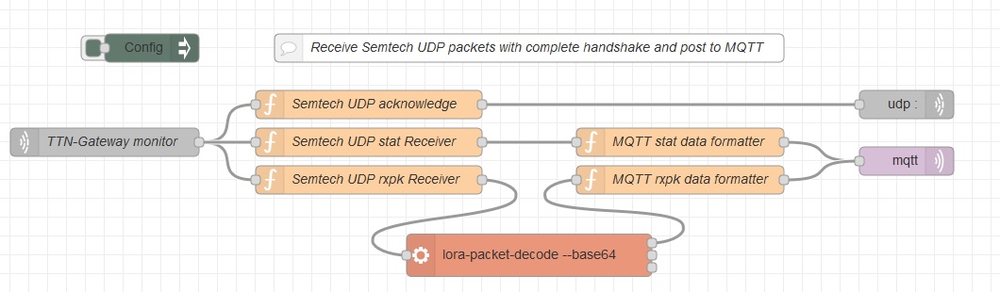

# Semtech-UDP-Packet-Forwarder-data-collector-for-Node-red
A Node-Red implementation of the server side for a LoRaWAN gateway that is using the Semtech UDP packet forwarder protocol. Data received is send to MQTT.

## Disclaimer
The PE1MEW Semtech-UDP-Packet-Forwarder-data-collector-for-Node-red is distributed in the hope that it will be useful, but WITHOUT ANY WARRANTY; without even the implied warranty of MERCHANTABILITY or FITNESS FOR A PARTICULAR PURPOSE.

## License
The PE1MEW Semtech-UDP-Packet-Forwarder-data-collector-for-Node-red is free software: You can redistribute it and/or modify it under the terms of a Creative Commons Attribution-NonCommercial 4.0 International License (http://creativecommons.org/licenses/by-nc/4.0/) by PE1MEW (http://pe1mew.nl) E-mail: pe1mew@pe1mew.nl.

 This work is licensed under a <a rel="license" href="http://creativecommons.org/licenses/by-nc/4.0/">Creative Commons Attribution-NonCommercial 4.0 International License</a>.

## Version history

version | Date      | Athour | Notes
--------|-----------|--------|-----------------------------------
1.0     | 12-1-2020 | PE1MEW | First release

## ToDo's

 1. Because "node-red-contrib-lora-packet-converter" is generating heavy loading of computer used, this node shall be replaced by a function that is parsing the phyPayload in Java script.

# Introduction
This flow is developed to receive data from a LoRaWAN gateway using the Semtech UDP protocol. The received data is published on a MQTT broker. Each packet send by teh gateway is acknowledged accordingly by the flow.

# Configuration

 1. Install node-red-contrib-lora-packet-converter in Node-Red.
 2. Copy the code in to a new flow in Node-red using "ctrl-i".
 3. Configure the MQTT client for the right Broker.
 4. Set the base topic (mqtt_base_topic) in de config node to the required prefix.
 4. Configure the second server of your LoRaWAN gateway to the ip-address of your Node-red server and set ports to 1701 (default in this flow)

## Prerequisites

 - node-red-contrib-lora-packet-converter
